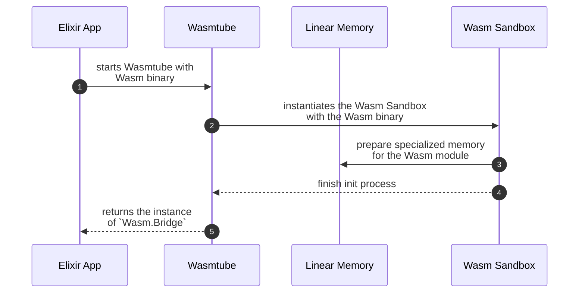
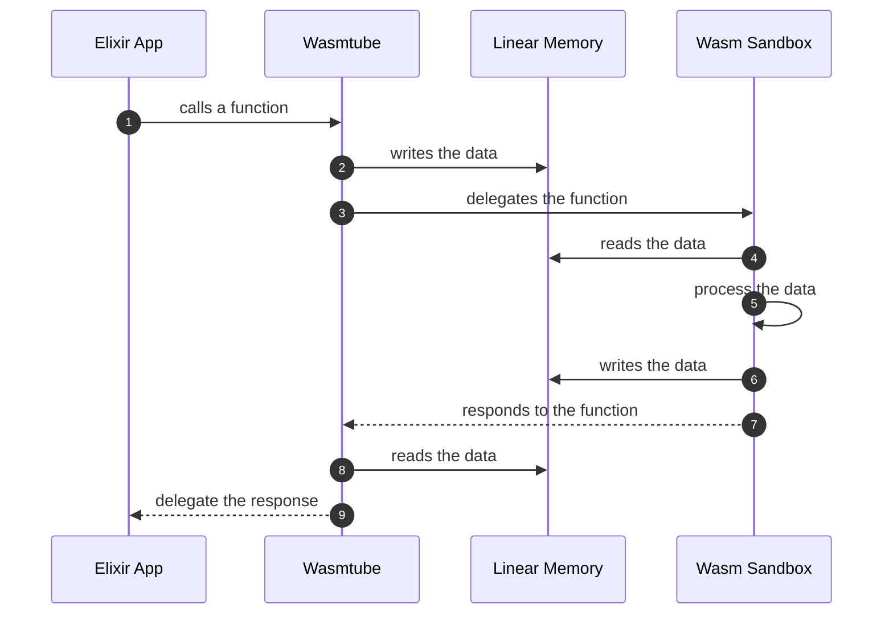
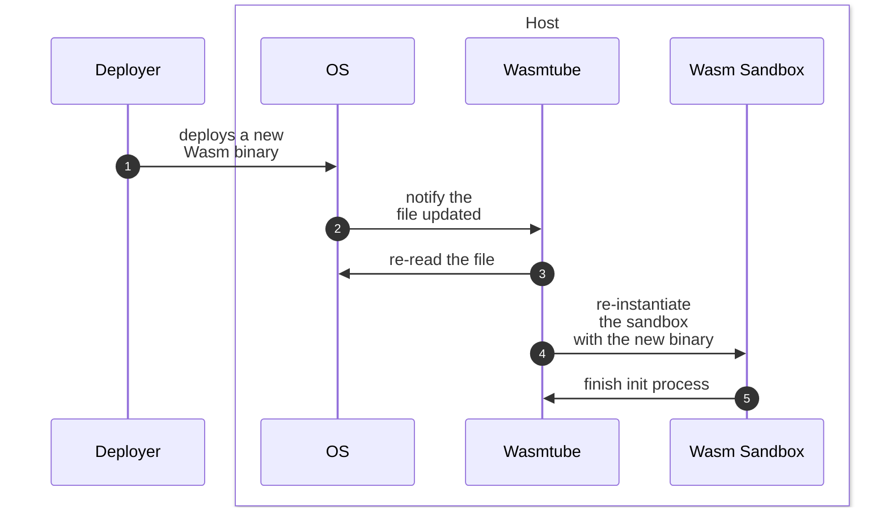

# Wasmtube

Wasmtube is a bridging library which allows you to communicate between Elixir and Wasm. It supports  structured values and images as arguments to be passed into Wasm functions.

## Installation

If [available in Hex](https://hex.pm/docs/publish), the package can be installed by adding `wasmtube` to your list of dependencies in `mix.exs`:

```elixir
def deps do
  [
    {:wasmtube, "~> 0.1.0"}
  ]
end
```

## Usage

### Use `Wasmtube` directly

`Wasmtube` provides simple APIs to instantiate Wasm sandbox specialized for a Wasm binary to which functions are called.

```elixir
Wasmtube.from_file("hello_world.wasm")
|> Wasmtube.call_function(:hello, data: %{
  arg: "World"
})
```

### Use `Wasmtube.Worker` to be supervised

`Wasmtube.Worker` is useful when you want to put the `Wasmtube` under supervision tree.

```elixir
{:ok, worker_pid} =
  Wasmtube.Worker.start_link(
    wasm_file: "hello_world.wasm",
    name: name
  )

worker_pid
  |> Wasmtube.Worker.call_function(:echo, data: %{
    arg: "World"
  })
```

## How `Wasmtube` works

Here's an illustration to help you intuitively understand how `Wasmtube` works.

### Initialization process



### Calling Wasm functions



### Update the Wasm functions

`Wasmtube` can handle updates of Wasm binary. It allows you to update the functions on the fly.



## How to implement Wasm functions

To get to know how to implement Wasm functions to be used with `Wasmtube`, see [wasm_test](./test/wasm_test) for details.

### Structured values

`Wasmtube` writes and reads structured values by which it interacts with Wasm sandbox into [Linear memory](https://docs.wasmtime.dev/contributing-architecture.html#linear-memory). You are supposed to read and write the data processed in Wasm function as JSON-encoded values.

Example implementation for above explanation looks like below:

```rust
#[no_mangle]
pub unsafe extern "C" fn echo(index: *const u8, length: usize) -> i32 {
    let slice = unsafe { slice::from_raw_parts(index, length) };
    let args: Args = serde_json::from_str::<Args>(str::from_utf8(slice).unwrap()).unwrap();

    store_into_memory(index, args)
}
```

See [wasm_test/src/lib.rs](./test/wasm_test/src/lib.rs) for details.

Call the function implemented above as below:

```elixir
Wasmtube.from_file("/path/to/wasm")
  |> Wasmtube.call_function(
    :echo,
    data: %{
      args: "Hello World!"
    }
  )
```

### Images

`Wasmtube` writes and reads images by which it interacts with Wasm sandbox into [Linear memory](https://docs.wasmtime.dev/contributing-architecture.html#linear-memory). You are supposed to read and write the data processed in Wasm function as binary-encoded values.

Example implementation for above explanation looks like below:

```rust
#[no_mangle]
pub unsafe extern "C" fn image_size(
    index: *const u8,
    _length: usize,
    width: u32,
    height: u32,
) -> i32 {
    let slice = unsafe { slice::from_raw_parts(index, (width * height * 3) as usize) };
    let img = image::RgbImage::from_raw(width, height, slice.to_vec()).unwrap();

    let image_info = ImageInfo {
        width: img.width(),
        height: img.height(),
    };

    store_into_memory(index, image_info)
}
```

See [wasm_test/src/lib.rs](./test/wasm_test/src/lib.rs) for details.

Call the function implemented above as below:

```elixir
Wasmtube.from_file("/path/to/wasm")
  |> Wasmtube.call_function(
    :image_size,
    image: File.read!("/path/to/image"),
      width: 256,
      height: 256
  )
```

### Build it

You can build it using [wasm-pack](https://rustwasm.github.io/wasm-pack/) as below:

```sh
cd test/wasm_test
wasm-pack build
```

You'll see a Wasm file at `test/wasm_test/target/wasm32-unknown-unknown/release/wasm_test.wasm`.

## Author

Kentaro Kuribayashi <kentarok@gmail.com>
